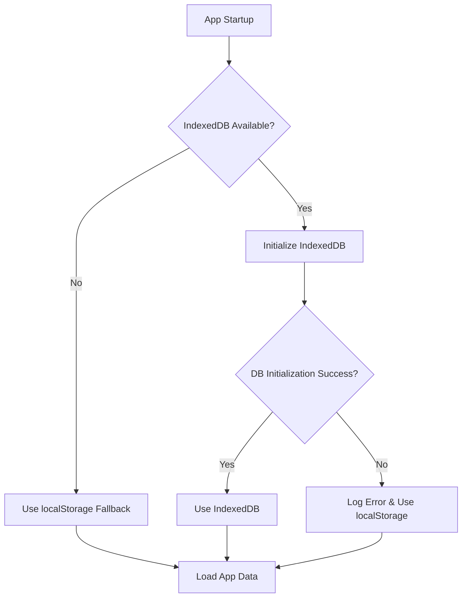

# IndexedDB Implementation Plan

## Overview

This document outlines the implementation strategy for replacing localStorage with IndexedDB to address storage size limitations and improve data persistence capabilities. **No migration needed** - users will start fresh with the new storage system.

## Current localStorage Usage Analysis

### Storage Keys Currently Used:
1. **Settings & Profiles** (`SettingsManager.ts`)
   - `expert_app_settings_profiles` - User profiles with criteria and settings
   - `expert_app_settings_last_profile` - Last used profile name

2. **Prompts** (`PromptManager.ts`)
   - `expert_app_prompts` - LLM prompt templates

3. **Projects** (`ProjectManager.ts`)
   - `expert_app_current_project` - Legacy single project storage
   - `expert_app_projects` - Multi-project data array
   - `expert_app_active_project` - Active project ID

4. **Templates** (`TemplateManager.ts`)
   - `expert_app_project_templates` - Project templates for different document types

5. **Model Configuration** (`ModelSelector.ts`)
   - `openrouter_api_key` - OpenRouter API key
   - `openrouter_model_purposes` - Selected models for each purpose

6. **UI State** (`project-ui.ts`)
   - `expert_app_collapsed_nodes` - Tree view collapsed state

### Size Limitations
- localStorage typically limited to 5-10MB
- Large projects with extensive content can exceed these limits
- JSON serialization overhead increases storage requirements

## IndexedDB Benefits

1. **Storage Capacity**: Virtually unlimited storage (limited by disk space)
2. **Performance**: Asynchronous operations, better for large datasets
3. **Data Types**: Can store objects directly without JSON serialization
4. **Transactions**: ACID-compliant transactions for data integrity
5. **Indexing**: Efficient querying and retrieval of specific data
6. **Versioning**: Built-in database versioning for schema changes

## Database Schema Design

### Database: `ExpertAppDB`
**Version**: 1

#### Object Stores:

```typescript
interface ExpertAppDB {
  // Settings and configuration
  settings: {
    key: 'profiles' | 'lastUsedProfile';
    value: Record<string, SettingsProfile> | string;
  };
  
  // Prompts
  prompts: {
    key: 'orchestrator_prompts';
    value: OrchestratorPrompts;
  };
  
  // Projects (one record per project)
  projects: {
    id: string; // project ID (primary key)
    title: string;
    templateName: string;
    createdAt: Date;
    lastModified: Date;
    data: string; // serialized project data
  };
  
  // Templates
  templates: {
    name: string; // template name (primary key)
    template: ProjectTemplate;
  };
  
  // Model configuration
  modelConfig: {
    key: 'apiKey' | 'selectedModels';
    value: string | Record<string, string>;
  };
  
  // UI state
  uiState: {
    key: 'collapsedNodes' | 'activeProject';
    value: string[] | string;
  };
}
```

#### Indexes:
- Projects: `by-lastModified` for recent projects
- Projects: `by-template` for filtering by template type

## Implementation Phases

### Phase 1: Database Service Creation ✅
- Create `IndexedDBService.ts` wrapper class
- Implement basic CRUD operations
- Add error handling and retry logic
- Create database initialization and versioning

### Phase 2: Storage Abstraction Layer ✅
- Create `StorageService.ts` that can use either localStorage or IndexedDB
- Implement fallback mechanism for browser compatibility
- Add storage detection and initialization

### Phase 3: Service Layer Updates ✅
- Update `SettingsManager.ts` to use new storage abstraction
- Update `PromptManager.ts` to use new storage abstraction
- Update `TemplateManager.ts` to use new storage abstraction
- Update `ModelSelector.ts` to use new storage abstraction

### Phase 4: Project Storage Updates ✅
- Update `ProjectManager.ts` to use IndexedDB directly
- Implement efficient project loading/saving
- Add project metadata management
- Update UI state persistence

### Phase 5: Testing & Cleanup ✅
- Comprehensive testing with large datasets
- Performance testing
- Storage capacity and performance validation
- Add storage usage monitoring
- Integrated test runner with storage test suite

## Implementation Details

### Storage Abstraction Interface

```typescript
interface IStorageService {
  // Generic operations
  get<T>(key: string): Promise<T | undefined>;
  set<T>(key: string, value: T): Promise<void>;
  delete(key: string): Promise<void>;
  
  // Bulk operations
  getAll<T>(prefix?: string): Promise<Record<string, T>>;
  clear(): Promise<void>;
  
  // Storage info
  getUsage(): Promise<{quota: number, usage: number}>;
  isIndexedDB(): boolean;
}
```

### Error Handling

1. **Browser Compatibility**: Fallback to localStorage if IndexedDB unavailable
2. **Storage Quotas**: Handle quota exceeded errors gracefully
3. **Corruption**: Detect and handle database corruption
4. **Network Issues**: Handle offline scenarios properly
5. **Transaction Failures**: Implement retry logic with exponential backoff

## Implementation Process Flow



## Performance Considerations

1. **Batch Operations**: Use transactions for bulk data operations
2. **Lazy Loading**: Load projects on-demand rather than all at startup
3. **Caching**: Implement in-memory caching for frequently accessed data
4. **Compression**: Consider compressing large project data
5. **Indexing**: Use indexes for efficient querying

## Backward Compatibility

1. **Fallback Support**: Automatic fallback to localStorage for older browsers
2. **Progressive Enhancement**: App works with either storage system
3. **No Data Loss**: If IndexedDB fails, gracefully continue with localStorage

## Testing Strategy

1. **Unit Tests**: Test IndexedDB operations in isolation
2. **Integration Tests**: Test storage abstraction layer
3. **Performance Tests**: Verify performance with large datasets
4. **Browser Tests**: Test across different browsers and versions
5. **Stress Tests**: Test with storage quota limits and failures

## Security Considerations

1. **Data Validation**: Validate all data before storing
2. **Access Control**: Ensure proper origin isolation
3. **Sensitive Data**: Handle API keys and tokens securely
4. **Encryption**: Consider encrypting sensitive project data

## User Experience

1. **Transparent Operation**: Users shouldn't notice the storage change
2. **Error Handling**: Graceful degradation if storage fails
3. **Performance**: Better performance with large projects
4. **Storage Monitoring**: Optional storage usage display

## Timeline Estimate

- **Phase 1**: ✅ Complete (Database service creation)
- **Phase 2**: ✅ Complete (Storage abstraction layer)
- **Phase 3**: ✅ Complete (Service layer updates)
- **Phase 4**: ✅ Complete (Project storage updates)
- **Phase 5**: ✅ Complete (Testing & cleanup)

**Total**: ✅ **COMPLETED** - All phases implemented successfully

## Success Metrics

1. **Storage Capacity**: Support projects >10MB without issues
2. **Performance**: No noticeable performance degradation  
3. **Compatibility**: Works across all supported browsers
4. **Data Integrity**: Zero data loss during operations
5. **User Satisfaction**: Seamless transition to new storage system 