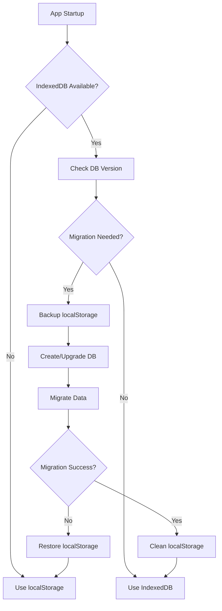

# IndexedDB Migration Plan

## Overview

This document outlines the migration strategy from localStorage to IndexedDB to address storage size limitations and improve data persistence capabilities.

## Current localStorage Usage Analysis

### Storage Keys Currently Used:
1. **Settings & Profiles** (`SettingsManager.ts`)
   - `expert_app_settings_profiles` - User profiles with criteria and settings
   - `expert_app_settings_last_profile` - Last used profile name

2. **Prompts** (`PromptManager.ts`)
   - `expert_app_prompts` - LLM prompt templates

3. **Projects** (`ProjectManager.ts`)
   - `expert_app_current_project` - Legacy single project storage
   - `expert_app_projects` - Multi-project data array
   - `expert_app_active_project` - Active project ID

4. **Templates** (`TemplateManager.ts`)
   - `expert_app_project_templates` - Project templates for different document types

5. **Model Configuration** (`ModelSelector.ts`)
   - `openrouter_api_key` - OpenRouter API key
   - `openrouter_model_purposes` - Selected models for each purpose

6. **UI State** (`project-ui.ts`)
   - `expert_app_collapsed_nodes` - Tree view collapsed state

### Size Limitations
- localStorage typically limited to 5-10MB
- Large projects with extensive content can exceed these limits
- JSON serialization overhead increases storage requirements

## IndexedDB Benefits

1. **Storage Capacity**: Virtually unlimited storage (limited by disk space)
2. **Performance**: Asynchronous operations, better for large datasets
3. **Data Types**: Can store objects directly without JSON serialization
4. **Transactions**: ACID-compliant transactions for data integrity
5. **Indexing**: Efficient querying and retrieval of specific data
6. **Versioning**: Built-in database versioning for schema changes

## Database Schema Design

### Database: `ExpertAppDB`
**Version**: 1

#### Object Stores:

```typescript
interface ExpertAppDB {
  // Settings and configuration
  settings: {
    key: 'profiles' | 'lastUsedProfile';
    value: Record<string, SettingsProfile> | string;
  };
  
  // Prompts
  prompts: {
    key: 'orchestrator_prompts';
    value: OrchestratorPrompts;
  };
  
  // Projects (one record per project)
  projects: {
    id: string; // project ID (primary key)
    title: string;
    templateName: string;
    createdAt: Date;
    lastModified: Date;
    data: string; // serialized project data
  };
  
  // Templates
  templates: {
    name: string; // template name (primary key)
    template: ProjectTemplate;
  };
  
  // Model configuration
  modelConfig: {
    key: 'apiKey' | 'selectedModels';
    value: string | Record<string, string>;
  };
  
  // UI state
  uiState: {
    key: 'collapsedNodes' | 'activeProject';
    value: string[] | string;
  };
}
```

#### Indexes:
- Projects: `by-lastModified` for recent projects
- Projects: `by-template` for filtering by template type

## Implementation Phases

### Phase 1: Database Service Creation
- Create `IndexedDBService.ts` wrapper class
- Implement basic CRUD operations
- Add error handling and retry logic
- Create database initialization and versioning

### Phase 2: Migration Utilities
- Create `MigrationService.ts` for data migration
- Implement localStorage to IndexedDB data transfer
- Add data validation and integrity checks
- Create backup/restore functionality

### Phase 3: Service Layer Updates
- Update `SettingsManager.ts` to use IndexedDB
- Update `PromptManager.ts` to use IndexedDB
- Update `TemplateManager.ts` to use IndexedDB
- Update `ModelSelector.ts` to use IndexedDB

### Phase 4: Project Storage Updates
- Update `ProjectManager.ts` to use IndexedDB
- Implement efficient project loading/saving
- Add project metadata management
- Update UI state persistence

### Phase 5: Testing & Rollout
- Comprehensive testing of migration process
- Performance testing with large datasets
- Fallback mechanisms for migration failures
- User communication about the upgrade

## Implementation Details

### IndexedDB Service Interface

```typescript
interface IIndexedDBService {
  // Database lifecycle
  initialize(): Promise<void>;
  close(): void;
  
  // Generic operations
  get<T>(store: string, key: string): Promise<T | undefined>;
  set<T>(store: string, key: string, value: T): Promise<void>;
  delete(store: string, key: string): Promise<void>;
  
  // Bulk operations
  getAll<T>(store: string): Promise<T[]>;
  bulkSet<T>(store: string, items: Array<{key: string, value: T}>): Promise<void>;
  
  // Projects specific
  getProjects(): Promise<ProjectRecord[]>;
  saveProject(project: ProjectRecord): Promise<void>;
  deleteProject(projectId: string): Promise<void>;
  getProjectsByTemplate(templateName: string): Promise<ProjectRecord[]>;
}
```

### Migration Strategy

1. **Detection**: Check if IndexedDB is supported and available
2. **Backup**: Create localStorage backup before migration
3. **Transfer**: Move data from localStorage to IndexedDB in transactions
4. **Validation**: Verify data integrity after migration
5. **Cleanup**: Remove localStorage data after successful migration
6. **Fallback**: Provide graceful degradation if IndexedDB fails

### Error Handling

1. **Browser Compatibility**: Fallback to localStorage if IndexedDB unavailable
2. **Storage Quotas**: Handle quota exceeded errors gracefully
3. **Corruption**: Detect and handle database corruption
4. **Network Issues**: Handle offline scenarios properly
5. **Transaction Failures**: Implement retry logic with exponential backoff

## Migration Process Flow



## Performance Considerations

1. **Batch Operations**: Use transactions for bulk data operations
2. **Lazy Loading**: Load projects on-demand rather than all at startup
3. **Caching**: Implement in-memory caching for frequently accessed data
4. **Compression**: Consider compressing large project data
5. **Indexing**: Use indexes for efficient querying

## Backward Compatibility

1. **Legacy Support**: Maintain localStorage fallback for older browsers
2. **Data Format**: Ensure imported localStorage data works with new system
3. **Export/Import**: Provide data export functionality for user peace of mind
4. **Gradual Migration**: Allow users to continue using the app during migration

## Testing Strategy

1. **Unit Tests**: Test IndexedDB operations in isolation
2. **Integration Tests**: Test migration process end-to-end
3. **Performance Tests**: Verify performance with large datasets
4. **Browser Tests**: Test across different browsers and versions
5. **Stress Tests**: Test with storage quota limits and failures

## Security Considerations

1. **Data Validation**: Validate all data before storing in IndexedDB
2. **Access Control**: Ensure proper origin isolation
3. **Sensitive Data**: Handle API keys and tokens securely
4. **Encryption**: Consider encrypting sensitive project data

## User Experience

1. **Migration Progress**: Show progress indicator during migration
2. **Error Communication**: Clear error messages for migration failures
3. **Data Export**: Provide easy data export/backup options
4. **Recovery Options**: Clear instructions for data recovery

## Rollback Plan

1. **Immediate Rollback**: Restore from localStorage backup if migration fails
2. **Long-term Rollback**: Maintain ability to export data back to localStorage
3. **Version Control**: Track database schema versions for compatibility
4. **Data Integrity**: Ensure data consistency during rollback operations

## Timeline Estimate

- **Phase 1**: 2-3 days (Database service creation)
- **Phase 2**: 2-3 days (Migration utilities)
- **Phase 3**: 3-4 days (Service layer updates)
- **Phase 4**: 2-3 days (Project storage updates)
- **Phase 5**: 2-3 days (Testing & rollout)

**Total**: 11-16 days

## Success Metrics

1. **Storage Capacity**: Support projects >10MB without issues
2. **Performance**: No noticeable performance degradation
3. **Migration Success**: >95% successful migrations
4. **Data Integrity**: Zero data loss during migration
5. **User Satisfaction**: Minimal user disruption during transition 